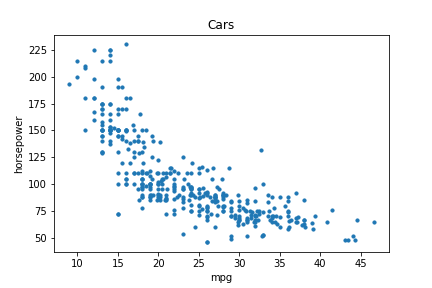
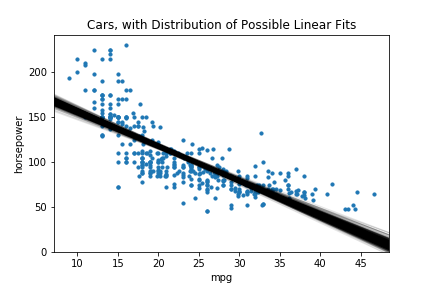
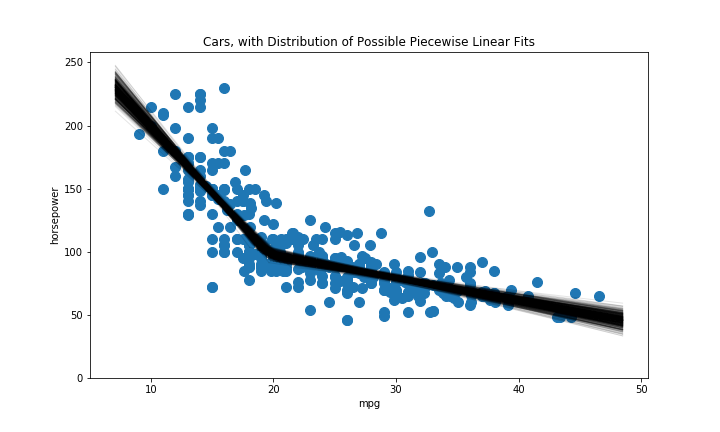

# MCMC and pymc3
- [MCMC and pymc3](#mcmc-and-pymc3)
  - [Basic](#basic)
    - [Installation of pymc3](#installation-of-pymc3)
    - [Part 1](#part-1)
  - [Advanced](#advanced)
    - [Part 2](#part-2)
  - [Extra Credit](#extra-credit)
    - [Part 3](#part-3)

This is a pair assignment for a pymc3 half-day session, using the cars dataset, mostly focusing on using Baysian statistics to do linear regression.

## Basic

### Installation of [pymc3](https://docs.pymc.io/)

```
pip install pymc3
```

It is recommended that you create an environment for this assignment.

### Part 1

0. Load the cars dataset from data directory. Make a scatterplot of the horsepower against the mpg.
Note: there might be some bad data points; feel free to drop them.



1. Use pymc3 to create a linear model predicting the horsepower from the mpg. You will have three parameters: beta0 (the intercept), beta1 (the slope), and sigma (the standard deviation of the error), with some reasonable values. Use a Normal distribution as prior for the first two, and a HalfNormal for the third. The observed values will follow a Normal distribution, based on those value and the horsepower.

2. Use find_MAP to find the maximum a posteriori results. Compare this to the results from in the model chosen by sklearn. Do you expect them to be the same? Are they?

3. Sample from your model to create a trace, and plot histograms of the values with plot_trace.

4. Show the various lines generated on top of the scatterplot of the data, by using at the beta0 and beta1 values of each element of the trace (note this will not show the values for sigma). To simplify it, only plot every 10th element of the trace.



## Advanced

### Part 2

5. The plot is not very linear. Try improving it by adding the square of the mpg as an additional feature and add that to your model.

6. Fit the data using a linear spline with a single knot. Unlike the splines we used in the past, the model will choose the position of the knot.

You will have five parameters here: the x and y position of the knot, the slope of the line on either side of the knot, and sigma. For the first you can use a Uniform distribution.

For the observed variable use the function `pm.math.where`. This takes three arguments: the condition, the value if True, and the value if False.

Check pm.traceplot() to make sure the values are reasonable.

7. Plot the linear splines on top of the data.



## Extra Credit
### Part 3

8. pymc3 has a glm module to simplify the expression of linear regression. To call that, replace the specifications of the variables with a line like `pm.glm.GLM.from_formula('horsepower ~ mpg', df)`. See http://docs.pymc.io/notebooks/GLM-linear.html for more information.

9. The problem with that approach is that the horsepower is inherently non-negative. There are a few approaches you can take to build this into your model. The simplest is to predict the log of the horsepower, but you can also explore other distributions.

10. Use the scatter_matrix in pandas function to choose other features that predict horsepower. Add these to the linear model.
